

    <h3 align="center">WebApp "<a href="https://vbutenk0.github.io/Read-Journey">Read Journey</a>"</h3>
    
Read Journey is an intuitive web application designed for book enthusiasts who want to track their reading progress and build a personalized library. Whether you're an avid reader or just starting your literary journey, Read Journey offers a seamless and engaging way to manage your books.

    
Table of Contents

    <ol>
        <li><a href="#features">Features</a></li>
        <li><a href="#technological-stack">Technological Stack</a></li>
        <li><a href="#links">Project Links</a></li>
    </ol>

## Features

### Recommended Books (Home)

The Recommended Books page is where users can explore the book catalog within the application.
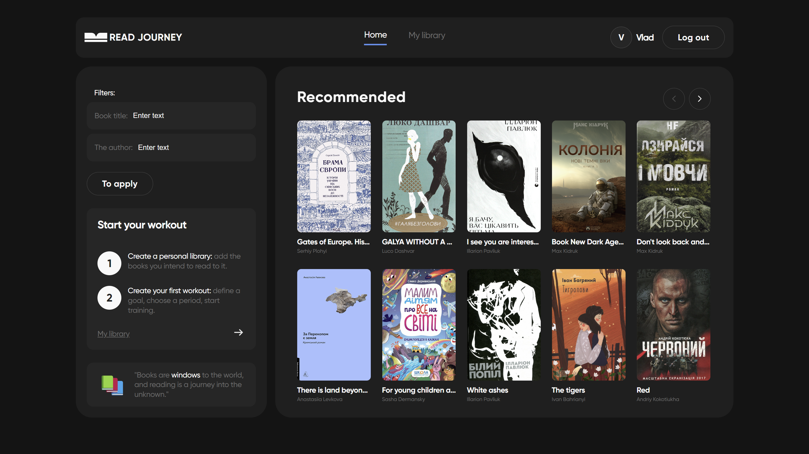

Books are displayed with pagination, which adjusts based on the screen size for optimal viewing.
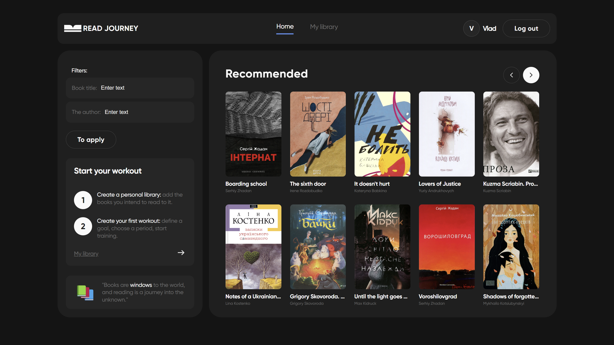

This page also features a search function that allows users to find books by title or author.
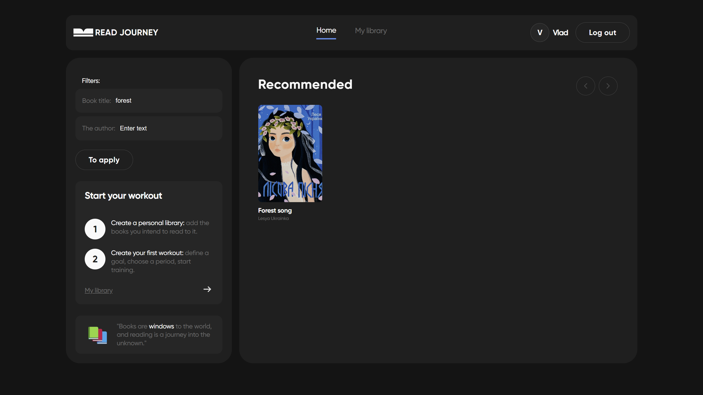
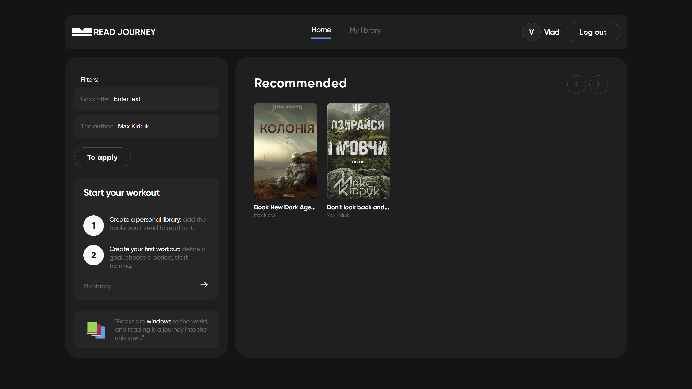

By clicking on a book from the list, users can add it to their personal library through a modal window that pops up.
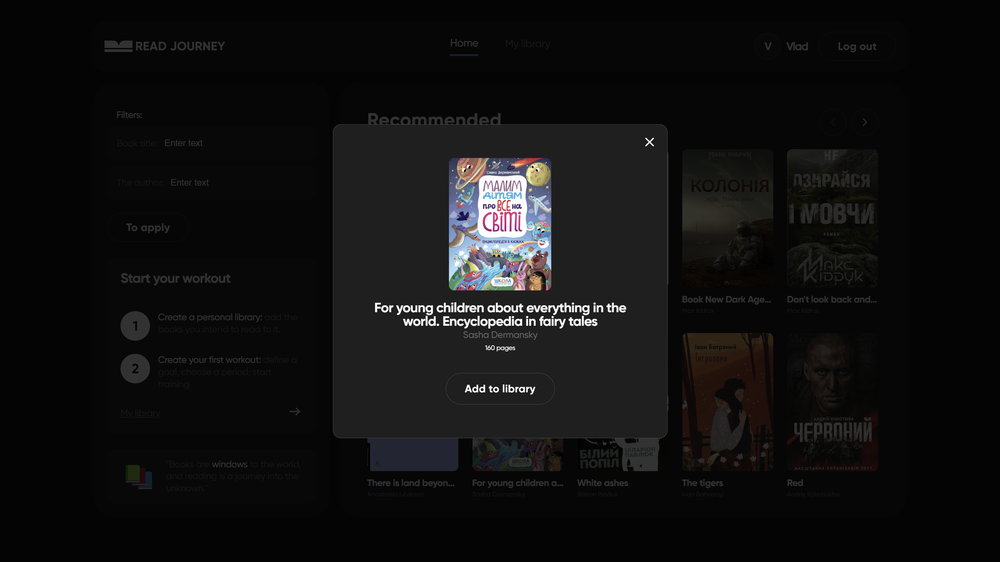

### My Library

The My Library page displays the books that users have added to their collection.
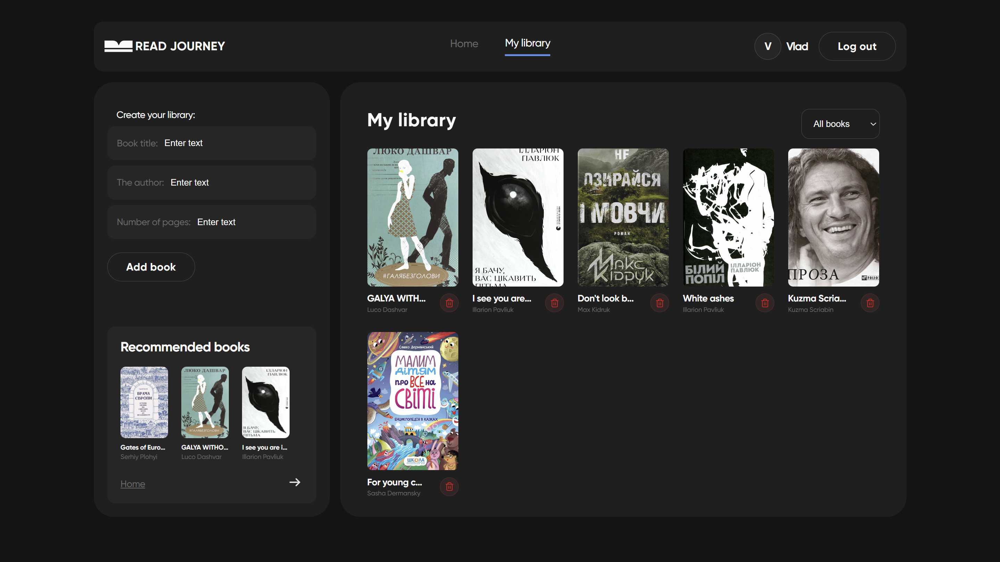

Here, users can add their own books by entering the title, author, and number of pages.
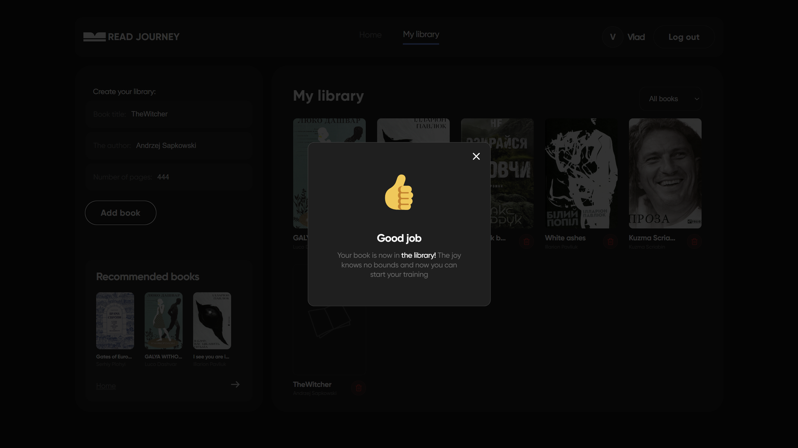
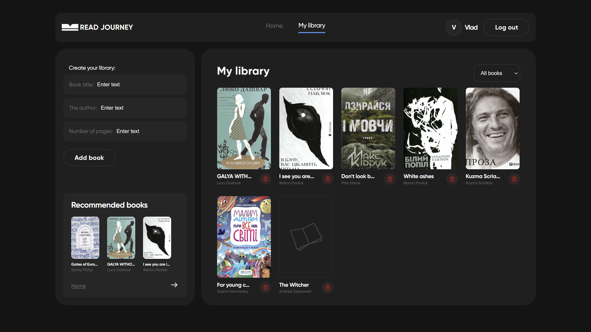

Additionally, users can filter their book list by reading status (Unread, In Progress, Done, All books).
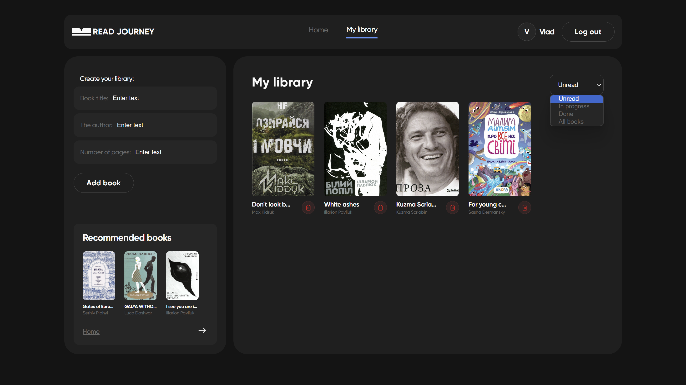
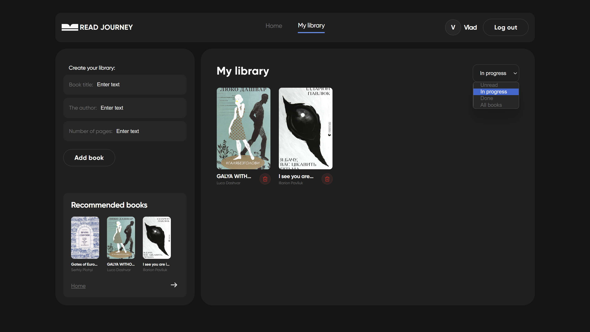
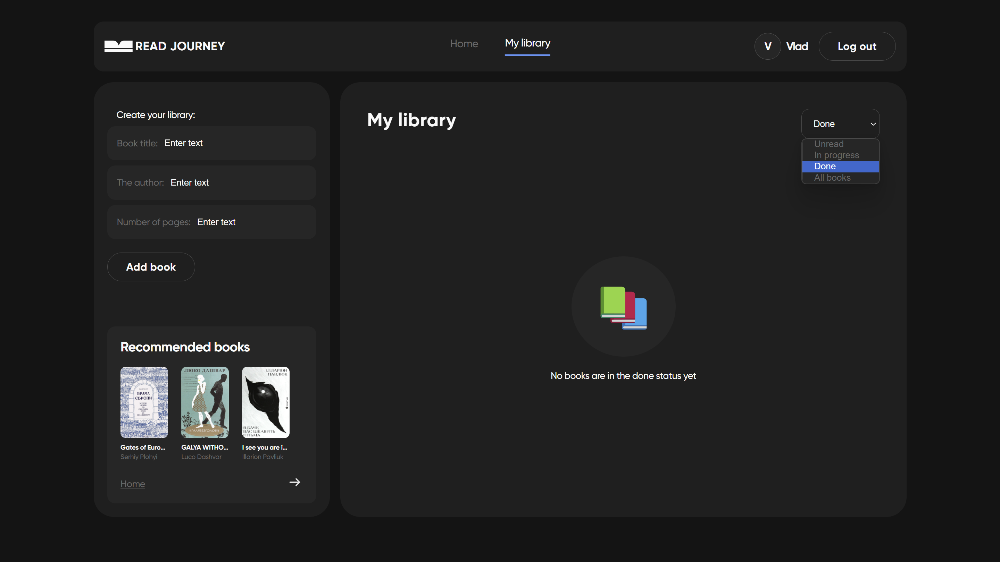

Clicking on a book in the list opens a modal window, allowing users to transition to the reading mode for that book.
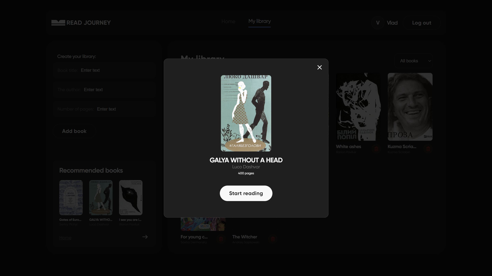

### Reading Page

The Reading page helps users track their reading progress for individual books. Before starting to read a book physically, users input the starting page in the app and click "To start," which begins recording the reading time. When they finish reading, users enter the ending page and click "To stop." After the initial reading session, users can view detailed statistics on their reading progress, including the percentage of pages read, reading speed, and total time spent reading. This information is conveniently divided into two tabs: Diary and Statistics, providing a comprehensive view of their reading habits.
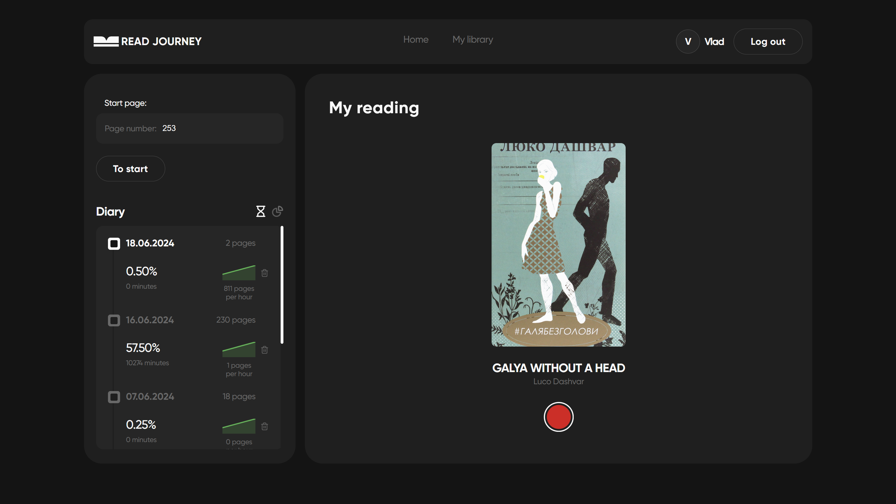
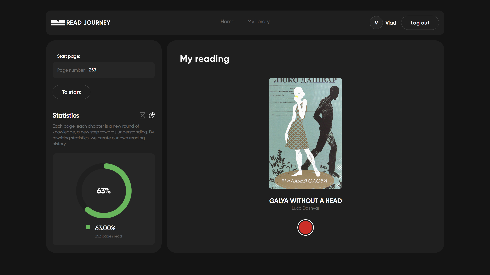

### Authentication

Read Journey offers a robust authentication system to ensure secure access to user accounts. Users can register for a new account, log in with existing credentials, and log out when done.
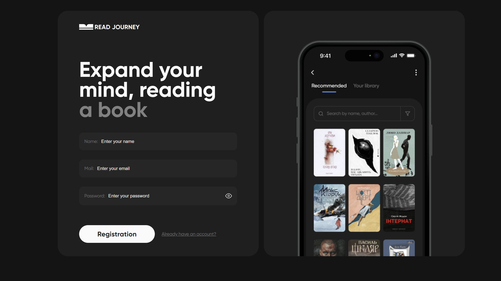
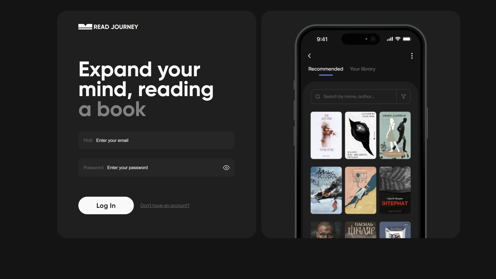
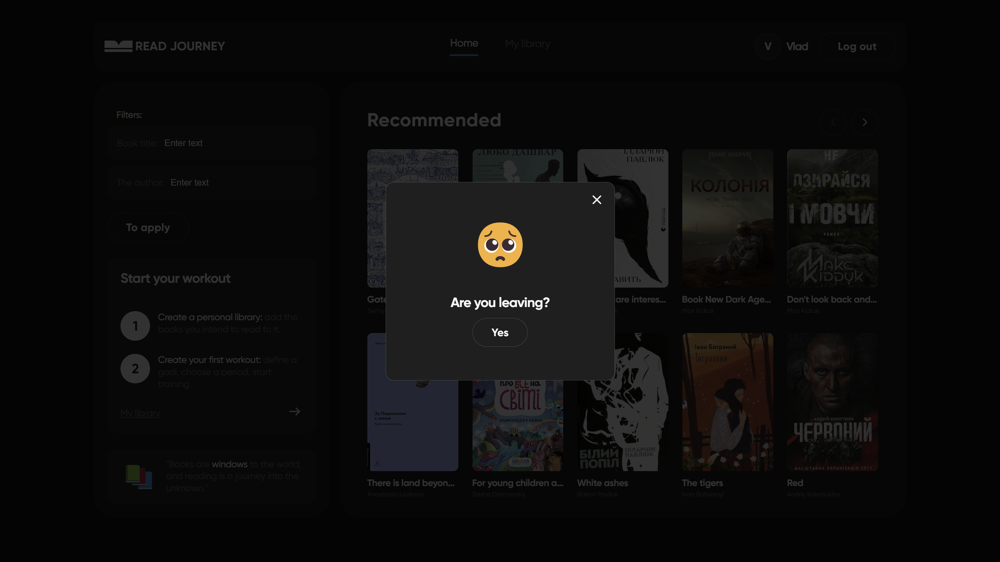
The application also includes an automatic refresh feature that maintains user authentication status across page reloads, providing a seamless and secure user experience.

## Technological Stack

- [React](https://react.dev)
- [React Redux](https://react-redux.js.org)
- [reduxjs/toolkit](https://redux-toolkit.js.org)
- [react-router-dom](https://reactrouter.com)
- [react-hook-form](https://react-hook-form.com/docs/useform)
- [yup](https://www.npmjs.com/package/yup)
- [styled-components](https://styled-components.com)
- [mui/material](https://mui.com)
- [react-toastify](https://fkhadra.github.io/react-toastify/introduction/)

## Links

- **Project Page**: [LearnLingo](https://vbutenk0.github.io/Read-Journey)
- **Design Mockup**: [Figma](https://www.figma.com/file/z3m0rdBcEfLTJUBDkAKhWQ/BOOKS-READING?type=design&node-id=18743%3A4973&mode=design&t=Hi1KTaUJMogWXZzz-1)
- **Technical Specification**: [Google Docs](https://docs.google.com/spreadsheets/d/1_f4IZzXDs6QhQq3mOCOMktYasPW1XphdTO82rdrkyW8/edit?gid=1060862504#gid=1060862504)

---

Read Journey simplifies the process of managing and tracking your reading, making it easier than ever to stay organized and motivated on your literary journey.
